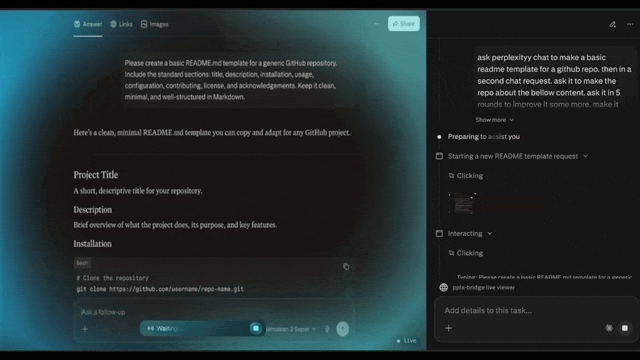
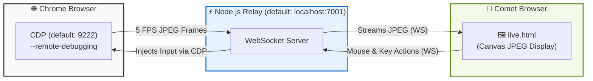

<div align="center">
  <h1>🌉 pplx-bridge</h1>

  <p>
    <a href="https://nodejs.org/"></a>
    <a href="https://pnpm.io/"></a>
    <a href="https://opensource.org/licenses/MIT"></a>
    <a href="https://github.com/eonist/pplx-bridge/pulls"></a>
  </p>

  <h3>A local relay to stream live Chrome tabs as interactive JPEG feeds for vision-based AI assistants.</h3>
</div>

---

Stream a live Chrome tab (`perplexity.ai`) as a continuous feed to a local relay. Point **Comet** at the relay, and the Comet Assistant can "see" the page as a video stream—sending clicks, keystrokes, and scrolls back via the **Chrome DevTools Protocol (CDP)**.

## 📸 See it in Action

<div align="center">
  
  <p><i>Comet Assistant interacting with a live Perplexity.ai tab via the local relay.</i></p>
</div>

---

## 📑 Table of Contents

- [Architecture](#️-architecture)
- [Features](#-features)
- [Installation & Setup](#-installation--setup)
- [Configuration](#️-configuration)
- [Action Types](#️-action-types)
- [Project Structure](#️-project-structure)
- [FAQ & Troubleshooting](#-faq--troubleshooting)

---

## 🏗️ Architecture

The bridge operates by linking a debugging instance of Chrome to a local WebSocket relay, which then streams visual frames to the Comet viewer. Each `(PORT, CDP_PORT)` pair runs as an independent `RelaySession` within the same Node.js process.



---

## ✨ Features

- 🚀 **Live Streaming** — Captures Chrome tabs as a low-latency JPEG feed at 5 FPS.
- 🤖 **AI-Native** — Designed specifically for Comet Assistant to "see" live web pages.
- 🖱️ **Full Interaction** — Translates clicks, keystrokes, and scrolls back to the browser via CDP.
- 🔒 **Local & Secure** — Runs entirely on localhost, keeping browsing data and credentials private.
- 🛠️ **Developer Friendly** — Clean WebSockets architecture built on Node.js and TypeScript.

---

## 🚀 Installation & Setup

Follow these stages to configure your environment and run the bridge.

> [!WARNING]
> **Chrome must be running in remote debugging mode.** Normal instances of Chrome (launched via Spotlight or the Dock) do not expose the required CDP WebSocket.

### Stage 1: System Prerequisites (macOS)
*(Skip to Stage 2 if you already have Node 20+ and pnpm installed).*
```bash
xcode-select --install
brew install node@20
echo 'export PATH="/opt/homebrew/opt/node@20/bin:$PATH"' >> ~/.zshrc
source ~/.zshrc
corepack enable && corepack prepare pnpm@latest --activate
```

### Stage 2: Install & Configure Browsers
1. Download **[Google Chrome](https://www.google.com/chrome/)** and **[Comet](https://www.perplexity.ai/comet)**.
2. Open Comet and navigate to **Settings → Assistant → Site access**.
3. Click **Add site**, type `localhost`, and set it to **Full access**.

> [!IMPORTANT]
> Without granting full site access to `localhost`, Comet Assistant will be blocked from reading the canvas or interacting with the viewer page.

### Stage 3: Clone & Build
```bash
git clone https://github.com/eonist/pplx-bridge.git
cd pplx-bridge
pnpm install
```

### Stage 4: Launch Chrome (Debug Mode)
Open a **new terminal tab** and launch an isolated Chrome profile:
```bash
/Applications/Google\ Chrome.app/Contents/MacOS/Google\ Chrome \
  --remote-debugging-port=9222 \
  --user-data-dir=~/.pplx-bridge-profile \
  https://perplexity.ai
```
*(Note: You will need to log into Perplexity on the first run. The custom `--user-data-dir` ensures your session persists across reboots.)*

### Stage 5: Start the Relay & Connect
In your **original terminal tab** (inside the `pplx-bridge` folder):
```bash
pnpm start
```
*When successful, the terminal will output:* `[relay:7001] CDP ready — input + screenshots active`.

Finally, open **Comet** and navigate to `http://localhost:7001/live`. You will see the live JPEG stream with a **● live** status indicator in the bottom right.

---

## ⚙️ Configuration

### Environment Variables

| Variable | Default | Description |
| :--- | :--- | :--- |
| `PORT` | `7001` | Relay HTTP/WS port (single session). Alias for `PORTS` with one entry. |
| `CDP_PORT` | `9222` | Chrome remote debugging port (single session). Alias for `CDP_PORTS` with one entry. |
| `PORTS` | `7001` | Comma-separated relay ports for multi-session, e.g. `7001,7002` |
| `CDP_PORTS` | `9222` | Comma-separated Chrome debug ports for multi-session, e.g. `9222,9223`. Must have the same number of entries as `PORTS`. |

### NPM Scripts

| Command | Action |
| :--- | :--- |
| `pnpm build` | Compiles TypeScript for all workspace packages |
| `pnpm start` | Builds packages and starts the relay |

### Running multiple sessions

<details>
<summary><b>Multi-session setup (two Chrome instances, one relay process)</b></summary>
<br/>

Launch one Chrome instance per session, each with its own debugging port and user-data-dir:

```bash
# Session 1
/Applications/Google\ Chrome.app/Contents/MacOS/Google\ Chrome \
  --remote-debugging-port=9222 \
  --user-data-dir=~/.pplx-bridge-profile-1 \
  https://perplexity.ai

# Session 2 (new terminal tab)
/Applications/Google\ Chrome.app/Contents/MacOS/Google\ Chrome \
  --remote-debugging-port=9223 \
  --user-data-dir=~/.pplx-bridge-profile-2 \
  https://perplexity.ai
```

Then start the relay with both port pairs:

```bash
PORTS=7001,7002 CDP_PORTS=9222,9223 pnpm start
```

Each session runs fully independently — its own WebSocket endpoints, action queue, screenshot stream, and reconnect loop. Open each viewer in Comet:
- `http://localhost:7001/live`
- `http://localhost:7002/live`

Health check per session: `GET http://localhost:700x/health` → `{ ok, port, cdpPort, cdp }`

</details>

---

## 🕹️ Action Types

The WebSocket relay translates incoming JSON payloads from the viewer into the following Chrome DevTools Protocol commands:

| Type | Payload | CDP Method |
| :--- | :--- | :--- |
| `click` | `{x, y}` normalised 0–1 | `Input.dispatchMouseEvent` |
| `type` | `{value}` string (single char or bulk) | `Runtime.evaluate` → `execCommand('insertText')` |
| `keydown` | `{key, code, modifiers}` | `Input.dispatchKeyEvent` |
| `scroll` | `{x, y}` delta | `Input.dispatchMouseEvent` (mouseWheel) |
| `mousemove` | `{x, y}` normalised 0–1 | `Input.dispatchMouseEvent` |

---

## 🗂️ Project Structure

```text
pplx-bridge/
├── .github/             # GitHub Actions & issue templates
├── packages/
│   ├── extension/       # Chrome extension (action sender & frame pusher)
│   ├── relay/           # Node.js WebSocket server & CDP client
│   │   └── src/
│   │       ├── main.ts          # Entry point — spawns one RelaySession per port pair
│   │       ├── relay-session.ts # Per-session Express + WSS + reconnect logic
│   │       └── cdp.ts           # CDPSession class — one per Chrome debug port
│   └── viewer/          # Static live.html canvas viewer
├── ACTION_PROTOCOL.md   # Documentation for action payload format
├── package.json         # Workspace configuration
└── pnpm-workspace.yaml  # pnpm workspace definition
```

---

## 🚑 FAQ & Troubleshooting

<details>
<summary><b>Viewer shows "disconnected"</b></summary>
<br/>
The relay is not running. Ensure you have run <code>pnpm start</code> in the <code>pplx-bridge</code> directory and that no errors were thrown.
</details>

<details>
<summary><b>Viewer shows a blank or black screen</b></summary>
<br/>
Chrome is likely not focused on a visible page. Click any tab within the debugged Chrome window to force a frame update.
</details>

<details>
<summary><b>Comet Assistant does nothing when prompted</b></summary>
<br/>
Comet does not have permission to interact with the local relay. Ensure <code>localhost</code> is set to <strong>Full access</strong> in Comet → Settings → Site access.
</details>

<details>
<summary><b>Error: <code>[relay:7001] CDP connect failed</code></b></summary>
<br/>
Chrome is not running with the required debugging flags. Stop Chrome completely and relaunch it using the command provided in Stage 4.
</details>

<details>
<summary><b>Error: <code>EADDRINUSE :::7001</code></b></summary>
<br/>
The port is already in use by another process. Run <code>lsof -ti :7001 | xargs kill -9</code> to free the port, then retry.
</details>

<details>
<summary><b>Error: <code>PORTS and CDP_PORTS must have the same number of entries</code></b></summary>
<br/>
The number of relay ports and CDP ports must match exactly. Example: <code>PORTS=7001,7002 CDP_PORTS=9222,9223</code>.
</details>

<br/>

> **Still having issues?** Contributions and bug reports are welcome! Please check the [Issues page](https://github.com/eonist/pplx-bridge/issues) for our current roadmap and known bugs.
